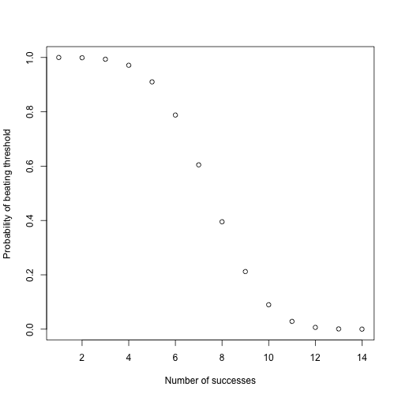

## The Problem

Many games have mechanics where you roll a bunch of six-sided dice and have to get a certain number of successes. 

  - Say you're designing one of these games, shouldn't you know how hard it is to achieve the goals you set?

  - If you play one of them, and you are choosing between two actions with different goals, wouldn't it be great to know how likely you are to succeed in each?

---

## The Dice Thresholdometer

Enter the Dice Thresholdometer, the simple shiny app that will generate those probabilities for you!

Simply enter the number of dice you are rolling, the number of successes you need, tell the app which of the common choices for success applies, and voila, instant probability.

For the mathematically minded among you, here's an example. Say you are rolling 18 six-sided dice looking for at least 10 successes, in a game where any roll over '4' is a success. The probability is calculated by running:


```r
chance <- 0
for (n in 10:18) {
      chance <- chance + (choose(18,n)*(3/6)^(n)*(3/6)^(18 - n))    
} 
print(chance)
```

```
## [1] 0.4073
```

---

## Why is it important to check these things? 

Well, with large numbers of dice given the change in the probability for a given required number of successes can be steep, as you can see from this plot for 14 six sided dice.

 

---
## Greater knowledge means better choices

  - Either improve your game design to make risky decisions neither trivial nor impossible, or never waste time trying things you're vanishingly unlikely to succeed on. 

  - Create well balanced games or make good strategic decisions. 

Any time you want to know the probabilities, use the Dice Thresholdometer to get them!


http://athiator.shinyapps.io/diceThresholdometer/


